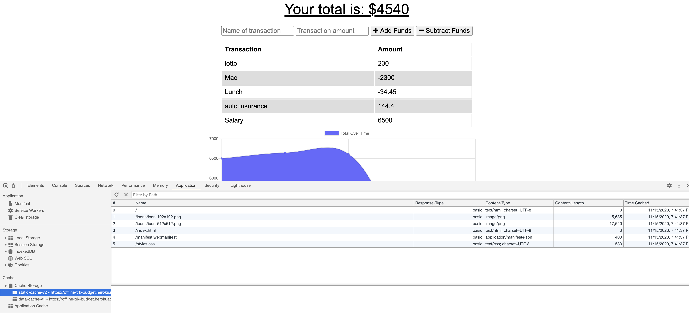
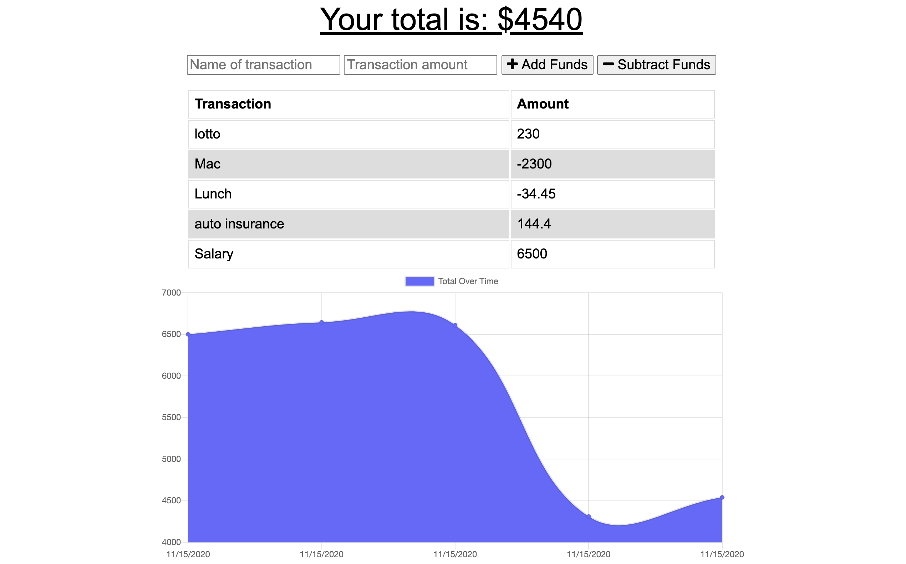
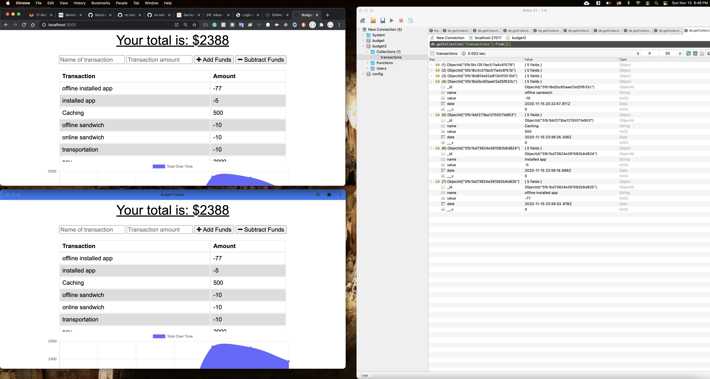

# offline-budget-tracker

## Description
   This Progressive Web Application (PWA) utilizes IndexDB and service workers to work offline and be installable as stand-alone chrome app. Built using Node.js, express, js, mongodb, mongoose and deployed to heroku with mongodb Atlas.

  ## Table of Contents:
  * [Installation](#Installation)
  * [Usage](#usage)
  * [License](#license)
  * [Contributions](#contributions)
  
  ## Techs
  MongoDB, Mongoose, Node.JS, JS, Express, IndexDB, PWA

  ## Installation
  To run the app on your local computer you'll need to have MongoDB, Nodejs installed. Download the project -> run npm i -> run mongodb.
  
  ## Usage
  The UI is simple, you can "add funds" or "subtract funds" and the app will keep track of your transactions and your total budget. All the functionalities work offline as well.  
  You can try the app on heroku here: [Heroku Deployed App](https://offline-trk-budget.herokuapp.com/).  
  
  ## Screenshots
  
  
  
  
  ## License
  None
  
  ## Contributions
  All contributions are welcome. Open an issue or contact me directly.
